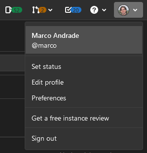

# Configuração de um computador com MacOS

1) Criar usuário

2) Logar com o novo usuário

3) Baixar e executar o `script_mac.sh`
```
wget https://lab.fslab.dev/script_mac.sh
sudo sh script
```

3) Configurar o git
```
git config --global user.name "Nome Completo"
git config --global user.email "nome.sobrenome@gmail.com"
```

4) Gerar a chave SSH
```
ssh-keygen
```

5) Visualizar a chave no GitLab
```
cat ~/.ssh/id_rsa.pub
```

6) Adicionar a chave no GitLab
- Copie o conteúdo da chave mostrada no terminal.
- Acesse [https://gitlab.fslab.dev](https://gitlab.fslab.dev)
- Vá em `Edit profile`.

- Depois em `SSH Keys`.
- Adicione a chave e clique no botão `Add key`.

A partir deste momento utilize o endereço com SSH para fazer o clone dos repositórios.
